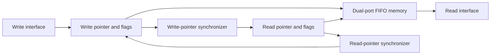
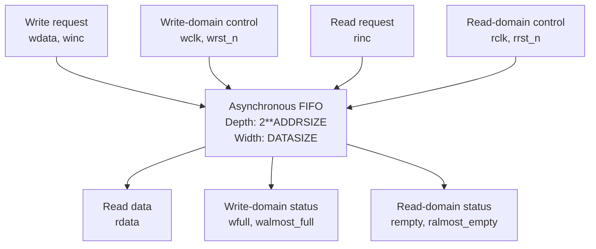

# Parameterized Asynchronous FIFO in SystemVerilog

A synthesizable asynchronous FIFO for transferring data safely between independent write and read clock domains. The design uses local binary pointers for memory addressing, Gray-coded pointers for clock-domain crossing, and two-stage synchronizers before pointer comparison.

This repository focuses on the **RTL design and synthesis flow**. The included testbenches provide readable design demonstrations for fill/drain and simultaneous read/write behavior.

## Design highlights

- Independent write (`wclk`) and read (`rclk`) clock domains
- Parameterized data width and FIFO depth
- Binary-to-Gray pointer conversion for clock-domain crossing
- Two-flop synchronization of Gray-coded pointers
- Full and empty detection without transferring multi-bit binary counters directly
- Almost-full and almost-empty status flags
- Separate storage, write-control, read-control, and CDC modules
- Example Design Compiler synthesis script with asynchronous clock constraints

## Default configuration

| Parameter | Default | Description |
| --- | ---: | --- |
| `DATASIZE` | 8 | Width of each stored word |
| `ADDRSIZE` | 4 | Number of memory address bits |
| FIFO depth | 16 | `2**ADDRSIZE` entries |
| `ALMOST_FULL_THRESHOLD` | 12 | Assert almost-full at 12 estimated entries |
| `ALMOST_EMPTY_THRESHOLD` | 4 | Assert almost-empty at 4 or fewer estimated entries |

The FIFO depth must be a power of two.

## Architecture



## External interface view

This view shows how a system connects to the FIFO without exposing its internal modules:



`winc` requests a write of `wdata` in the `wclk` domain, while `rinc` requests that the read pointer advance in the independent `rclk` domain. The status outputs provide flow control so upstream logic does not write when full and downstream logic does not read when empty.

Each clock domain owns its local binary pointer. The binary pointer selects the memory address and is converted to Gray code before crossing into the other domain. Because adjacent Gray-code values differ by only one bit, the receiving domain can safely capture the pointer through a two-stage synchronizer.

### Write path

On each rising edge of `wclk`, an accepted write increments the local binary write pointer. The write address uses the lower `ADDRSIZE` bits, while the extra pointer bit records wraparound. The next binary pointer is converted to Gray code and registered as `wptr`.

The synchronized read pointer is converted back to binary to estimate occupancy for `walmost_full`. `wfull` is detected in Gray-code space by comparing the next write pointer with the synchronized read pointer after inverting its two most-significant bits.

### Read path

On each rising edge of `rclk`, an accepted read increments the local binary read pointer. The lower pointer bits select the memory location, and the registered Gray-code value is exported as `rptr`.

The FIFO is empty when the next read pointer equals the synchronized write pointer. The synchronized write pointer is also converted to binary to estimate occupancy for `ralmost_empty`.

### Clock-domain crossing

Only Gray-coded pointers cross clock boundaries. `fifo_sync_w2r` samples the write pointer into the read domain, while `fifo_sync_r2w` samples the read pointer into the write domain. Each module uses two flip-flop stages to reduce metastability propagation risk.

Because synchronized pointers arrive after two destination-clock cycles, the almost-full and almost-empty flags are conservative estimates rather than instantaneous global counts.

## Repository files

| File | Contribution to the design |
| --- | --- |
| [`rtl/fifo_top.sv`](rtl/fifo_top.sv) | Top-level integration of memory, pointer generators, status logic, and CDC synchronizers |
| [`rtl/fifo_memory.sv`](rtl/fifo_memory.sv) | Parameterized storage array with write-domain control and asynchronous read access |
| [`rtl/fifo_write.sv`](rtl/fifo_write.sv) | Write pointer generation, write address, Gray conversion, full detection, and almost-full calculation |
| [`rtl/fifo_read.sv`](rtl/fifo_read.sv) | Read pointer generation, read address, Gray conversion, empty detection, and almost-empty calculation |
| [`rtl/fifo_sync_r2w.sv`](rtl/fifo_sync_r2w.sv) | Two-stage synchronization of the Gray-coded read pointer into the write domain |
| [`rtl/fifo_sync_w2r.sv`](rtl/fifo_sync_w2r.sv) | Two-stage synchronization of the Gray-coded write pointer into the read domain |
| [`tb/tb_fifo_write_then_read.sv`](tb/tb_fifo_write_then_read.sv) | Demonstrates filling the FIFO to full and draining it back to empty |
| [`tb/tb_simultaneous_write_read.sv`](tb/tb_simultaneous_write_read.sv) | Demonstrates concurrent traffic under different write and read clock frequencies |
| [`synthesis/compile_dc.tcl`](synthesis/compile_dc.tcl) | Reproducible synthesis setup, clock constraints, reports, and mapped-netlist output |

## Interface

| Signal | Domain | Direction | Purpose |
| --- | --- | --- | --- |
| `wdata` | `wclk` | Input | Data presented for writing |
| `winc` | `wclk` | Input | Write request; accepted when `wfull` is low |
| `wfull` | `wclk` | Output | Prevents writes when no entries are available |
| `walmost_full` | `wclk` | Output | Early backpressure indicator |
| `rdata` | `rclk` | Output | Data at the current read address |
| `rinc` | `rclk` | Input | Read request; accepted when `rempty` is low |
| `rempty` | `rclk` | Output | Prevents reads when no data is available |
| `ralmost_empty` | `rclk` | Output | Early low-occupancy indicator |
| `wrst_n` | `wclk` | Input | Active-low reset for write-domain state |
| `rrst_n` | `rclk` | Input | Active-low reset for read-domain state |

## Simulation

The testbenches generate VCD waveforms and can be run with any SystemVerilog simulator. For example, with Icarus Verilog:

```bash
iverilog -g2012 -s tb_fifo_write_then_read \
  -o fifo_fill_drain.vvp rtl/*.sv tb/tb_fifo_write_then_read.sv
vvp fifo_fill_drain.vvp

iverilog -g2012 -s tb_fifo_simult_read_write \
  -o fifo_concurrent.vvp rtl/*.sv tb/tb_simultaneous_write_read.sv
vvp fifo_concurrent.vvp
```

Generated waveform files can be opened in GTKWave.

## Synthesis

The included script targets Synopsys Design Compiler and expects `PDK_DIR` to contain `gscl45nm.db` from the OSU FreePDK 45 nm library:

```bash
cd synthesis
dc_shell -f compile_dc.tcl
```

The academic synthesis run used ideal clock assumptions and reported the following tool estimates:

| Metric | Reported value |
| --- | ---: |
| Total standard cells | 1,237 |
| Sequential cells | 172 |
| Total cell area | 3,770.825 library units |
| Dynamic power estimate | 4.4914 mW |
| Leakage power estimate | 21.9354 µW |
| Write-clock constraint | 0.625 ns, 0.00 ns setup slack |
| Read-clock constraint | 1.25 ns, 0.19 ns setup slack |

These values are synthesis estimates for one library and constraint set; they are not FPGA utilization results or measured silicon performance.

## Design notes

- The memory depth is `2**ADDRSIZE`.
- The full-comparison expression requires `ADDRSIZE >= 2`.
- Writes occur only when `winc && !wfull`; reads advance only when `rinc && !rempty`.
- Reset assertion is asynchronous. In a larger system, reset deassertion should be synchronized independently in each clock domain.
- The asynchronous memory read style is intentional for this implementation; FPGA block-RAM inference depends on the target device and synthesis tool.

## Reference

The pointer and full/empty architecture follows the established asynchronous-FIFO technique described by Clifford E. Cummings in *Simulation and Synthesis Techniques for Asynchronous FIFO Design* (SNUG 2002).
